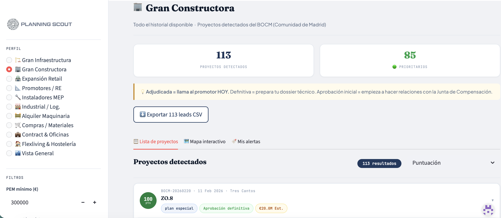
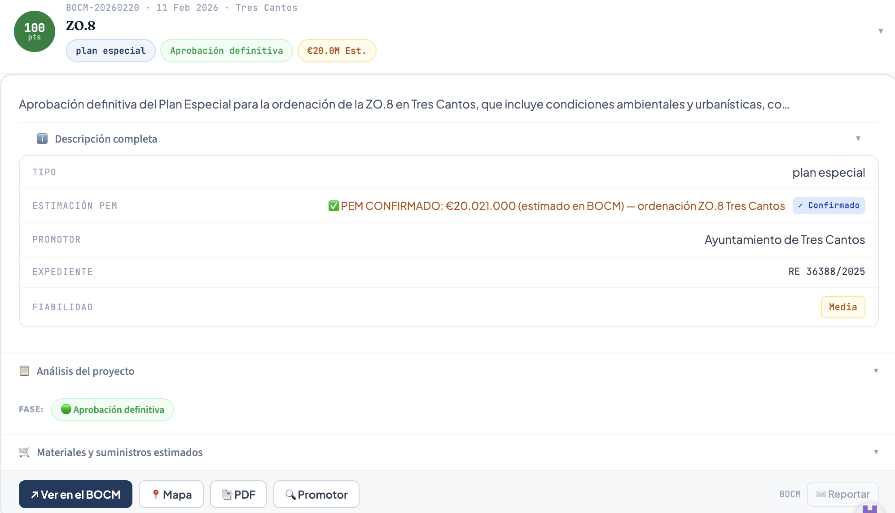

# PlanningScout

**Construction intelligence platform for the Madrid region.**  
Aggregates 10+ official Spanish public sources daily, classifies 
leads with AI, and delivers sector-specific analysis via a live 
web dashboard.

🔗 **Live dashboard:** [planningscout.streamlit.app](https://planningscout.streamlit.app)

---

## What it does

The Spanish construction sector generates hundreds of official 
publications daily across BOCM, BOE, CM Contratos Públicos, 
datos.madrid.es, BORME, and more. These are public records that 
contain high-value commercial intelligence — but they're buried 
in PDFs and bureaucratic language.

PlanningScout reads all of them automatically every working day, 
extracts the relevant data, scores each opportunity 0–100 by 
sector relevance, and presents it in an actionable dashboard.

**For each detected project, the system extracts:**
- Project type, phase, municipality, address
- Declared or AI-estimated PEM (budget)
- Promotor / applicant
- Sector-specific analysis (materials quantities, machinery 
  urgency, coliving potential, retail catchment data)
- Phase change alerts when a project advances

---

## Screenshots

**Dashboard — Gran Constructora profile (113 projects detected)**

**Lead card — ZO.8 Plan Especial, Tres Cantos (€20M, Aprobación 
Definitiva)**

---

## Data sources (10+ integrated)

| Source | What it provides |
|--------|-----------------|
| BOCM Section III | Daily licencias, urbanizaciones, planes especiales |
| BOCM Section V | ICIO tax notifications with declared PEM |
| BOE | State-level licitaciones públicas |
| CM Contratos Públicos | Regional public tenders (ATOM feed) |
| datos.madrid.es | Madrid capital licencias urbanísticas (XLSX) |
| BORME | New construction companies registered |
| Portal del Suelo CM | Available plots for sale/concession |
| ITE Padrón | Buildings mandated to rehabilitate |
| PLACE Nacional | National public procurement platform |
| Sede Madrid GIS | Licencias with GPS coordinates |

---

## Technical stack

- **Python** — core scraping, data extraction, async processing
- **OpenAI GPT-4o-mini** — document classification, sector field 
  extraction, AI evaluation per lead
- **Google Sheets API** (gspread) — persistent storage and 
  real-time data sync
- **Streamlit** — web dashboard, session auth, interactive map
- **BeautifulSoup / lxml** — HTML and XML parsing
- **asyncio + ThreadPoolExecutor** — concurrent document processing
- **GitHub Actions** — daily automated runs (cron schedule)

## Architecture
10+ Official Sources
↓
Python Engine (daily cron via GitHub Actions)
├── Source scrapers (BOCM, BOE, CM Contratos, BORME...)
├── PDF text extraction
├── GPT-4o-mini classification + sector field extraction
├── Lead scoring (0–100, sector-weighted)
└── Upsert to Google Sheets (phase tracking, dedup)
↓
Google Sheets (Leads tab — master data store)
↓
Streamlit Dashboard
├── 10 sector profiles with tailored filters
├── Interactive map (all projects geolocated)
├── Mis Alertas (watchlist + phase-change email alerts)
└── CSV export

---

## Sector profiles

The dashboard filters and re-scores leads per sector:

| Profile | Target user | Key signals detected |
|---------|------------|---------------------|
| Gran Infraestructura | FCC, ACS, Ferrovial bid depts | Licitaciones >€5M, urbanizaciones |
| Gran Constructora | Medium constructoras | All obra mayor, reparcelaciones |
| Promotores / RE | Property developers, funds | Juntas de compensación, plan parcial |
| Instaladores MEP | HVAC, electrical, lift companies | Obra mayor, rehab, hospitals |
| Alquiler Maquinaria | Kiloutou, Loxam | Adjudicaciones + earthwork estimate |
| Compras / Materiales | Molecor, Holcim, Saint-Gobain | Saneamiento, abastecimiento licitaciones |
| Industrial / Log. | Logistics developers | Nave industrial, polígono permits |
| Contract & Oficinas | ACTIU, office furniture | Office rehab, hospital builds |
| Flexliving & Hostelería | Coliving operators | Large residential permits, senior living |
| Expansión Retail | Supermarket/fashion expansion | New residential density, uso changes |

---

## Key engineering decisions

- **Single-pass AI extraction:** Each document is processed once 
  by GPT-4o-mini with a structured JSON prompt covering all 10 
  sector field sets simultaneously. No repeated calls.
- **Upsert logic:** Leads are matched by expediente number. If a 
  project advances phase (inicial → definitivo), the existing row 
  is updated and a phase-change alert is sent to watching users.
- **Non-blocking Catastro enrichment:** After AI extraction, the 
  engine queries the Catastro REST API for building age and floor 
  count. Runs in background, never blocks the main pipeline.
- **PEM separation:** Column F (declared PEM) is only written when 
  the source document contains an officially declared figure. 
  AI estimates go to Column R. Users always know which is which.

---

*Built and maintained independently. Running in production since 
January 2025.*
